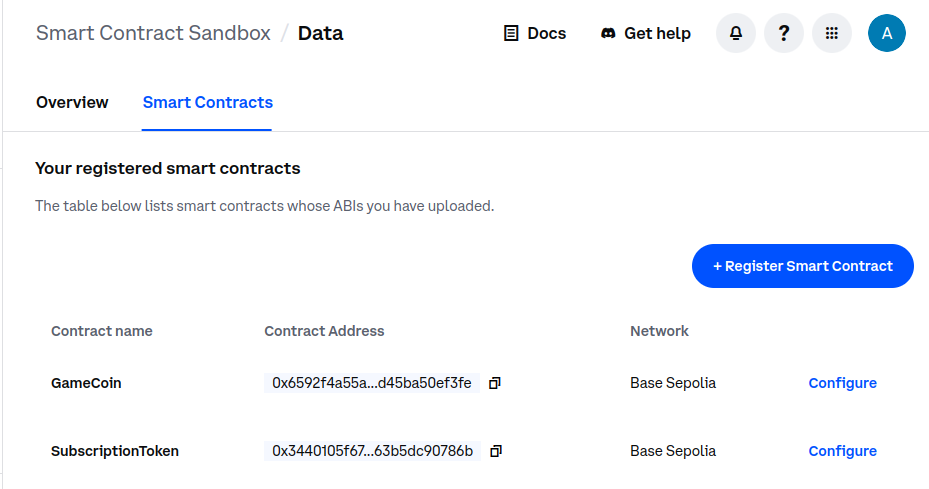
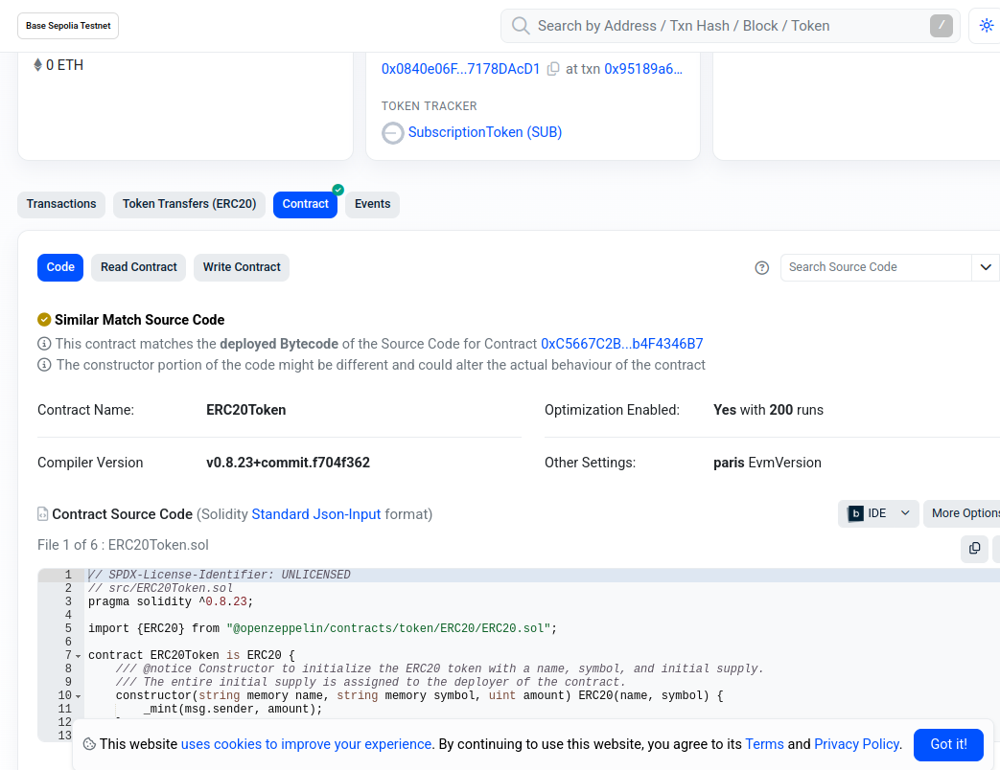

# Smart Contracts 101: A Beginner's Guide using Coinbase SDK and in-game currency

## Introduction

The purpose of this blog post is to help those new to developing Blockchain technology understand Smart Contracts and how they would work in a general use case.

You will learn:

- [x] The rundown on Smart Contracts and their value
- [x] How to create and deploy a token contract for in-game transactions (including a supply of Game tokens)
- [x] How to interact with the contract in your video game code

Keep reading to learn how to apply Smart Contracts to an in-game purchase from a store.

### Prerequisites

It is assumed you have already completed the [Getting Started](../welcome/getting-started.md) guide. If so, you should have:

- [x] An existing Coinbase account
- [x] A configured API key

This guide also assumes: 

- You are running Python `v3.12.3+`
- You have at least two [funded wallets](../welcome/backend-create-wallet.md); One for a game player and another for the game shop

### What is a Smart Contract?

To help us understand Smart Contracts, we can draw an analogy using a developer concept you are likely familiar with: APIs. 

APIs (and more specifically, API Specs) are contracts between a client and server, which yields for some nice parallels. Both APIs and Smart Contracts:

| **Aspect** | **APIs** | **Smart Contracts** |
|------------|----------|---------------------|
| Definition of rules/structure for how two parties interact | Valid requests and expected responses | Valid inputs and resulting actions |
| Deterministic | Server processes requests with predictable responses | Executes transactions according to logic with predictable result |
| Immutable and Versioned | Versioning for backward compatibility. Once an API is deployed, developers rely on its stability | Cannot be changed once deployed (similar to a fixed API version) |

### The value of Smart Contracts

While APIs rely on a centralized server, a Smart Contract differs in that its true value is in the nature of its decentralized environment. Because Smart Contracts run on the blockchain, this means:

- **[Trustless](https://academy.binance.com/en/glossary/trustless) Transactions:** Because Smart Contracts are immutable, promises are unbreakable. Invested parties only need to trust in the code instead of asking, "Can I trust this person?"
- **Transparency:** A deployed contract can be inspected by anyone on the blockchain. 
- **Automated:** Contract rules are enforced automatically without a middle man.

A Smart Contract is an unbreakable promise. Hopefully at this point you can see how they might be useful for various agreements, whether pretend money (like in a video game), or actual currency (for example, an agreement when purchasing a car or home).

### Tools used

- **Coinbase Developer Platform:** Set of tools and APIs that allow developers to integrate Coinbase services into decentralized applications, enabling easy management of crypto assets, transactions, and more.
  - **Coinbase Wallet API:** Create and manage cryptocurrency wallets, enabling secure storage and transactions of digital assets.
  - **Coinbase Transfers API:** Provides programmatic access to initiate, monitor, and manage cryptocurrency transfers, allowing integration of payments and transfers into applications.
  - **Platform Portal:** Web interface where developers can manage their projects, access API documentation, and configure their API keys and other settings for integration with Coinbase’s services.

While Smart Contracts come in multiple flavors, this guide will be using `ERC20` format.

??? question "What Smart Contract formats are available?" 

    - **ERC20:** A contract that keeps track of fungible tokens (any one token is exactly equal to any other token)
    - **ERC721:** A contract that keeps track of non-fungible tokens (where each token is unique, i.e., real estate or collectibles)
    - **ERC777:** ERC20, but with more sophisticated interactions via hooks and abstraction/simplification of token interactions.
    - **ERC1155:** Agnostic (fungible and non-fungible) contract with support for multiple types of tokens per contract.

    Read more in the [Open Zeppelin docs](https://docs.openzeppelin.com/contracts/3.x/tokens).

## Typical Smart Contract Workflow

Typically, to create and deploy an ERC20 Smart Contract involves many steps:

1. Creating the Solidity contract code
1. Implementing its required functions (`totalSupply`, `balanceof`, `transfer`, `approve`, `transferFrom`, etc. OpenZeppelin offers these implementations [out of the box](https://docs.openzeppelin.com/contracts/5.x/api/token/erc20)) and any custom features
1. Compiling the contract into bytecote for the [Ethereum Virtual Machine (EVM)](https://ethereum.org/en/developers/docs/evm/) to execute
1. Deploy the contract 
1. Finally, interact with the contract

As a recommendation, these steps should also include testing (using tools like `brownie` or `truffle`, creating unit tests, and running test deployments to a testnet).

??? question "What does an ERC20 contract look like?" 

    As an example, take a look at this (simplified) basic, bare bones example. Contracts are written using the [Solidity programming language](https://soliditylang.org/). We will continue going into the details throughout the rest of the tutorial, so don't focus on that too much. This is just to give you a general idea.

    ```sol title="SimpleToken.sol"
    // SPDX-License-Identifier: MIT
    pragma solidity ^0.8.0;

    contract SimpleToken {
        string public name = "SimpleToken";
        string public symbol = "STK";
        uint8 public decimals = 18;
        uint256 public totalSupply;
        mapping(address => uint256) public balanceOf;

        constructor(uint256 _initialSupply) {
            totalSupply = _initialSupply * 10 ** uint256(decimals);
            balanceOf[msg.sender] = totalSupply;
        }

        function transfer(address _to, uint256 _amount) public returns (bool) {
            require(balanceOf[msg.sender] >= _amount, "Insufficient balance");
            balanceOf[msg.sender] -= _amount;
            balanceOf[_to] += _amount;
            return true;
        }

        ...
    }
    ```

Keep reading and we will compare why the Coinbase Developer Platform SDK makes these process much easier.

## Coinbase Smart Contract Workflow

See how intensive a typical workflow is when creating even a basic Smart Contract? This is where the Coinbase Developer Platform SDK can really step in to alleviate you of your pain!

Coinbase provides SDKs and APIs to help simplify blockchain development which you can use to streamline the process and focus on other functionality.

Using Coinbase, you can create and deploy a Smart Contract with very minimal coding, leading to:

- **Easier use and faster development:** Skip time-consuming steps of writing contracts manually
- **Reduced risk:** Coinbase is a well-tested SDK which will help you avoid common errors or vulnerabilities
- **Focus on innovation:** Spend less time on low-level blockchain details since Coinbase abstracts much of this complexity away
- **Scalability:** Coinbase tools are designed to scale with your project, making it easier to grow with your user base

Let's get started.

## Step 1 -- Create and deploy a Smart Contract

That's right, it's just one step to create and deploy a Smart Contract using CDP's Wallet API!

Using a new or existing wallet, you can call Coinbase's `deploy_token` function which takes 3 parameters:

- A token name
- A token symbol
- Initial supply

And that's it!

??? question "Why do I need to create a token with the contract?"

    A Smart Contract needs tokens because the contract defines rules and behavior *for* transacting these tokens on the Ethereum blockchain. The ERC20 standard provides a set of functions that allow creation, transfer, or tracking of tokens within the Ethereum ecosystem. The Open Zeppelin implementation provides these out of the box and is inherited under-the-hood in the Coinbase API:

    - **`totalSupply`:** The total number of tokens that will ever exist
    - **`balanceOf`:** Returns the value of tokens owned by an account
    - **`transfer`:** Moves tokens from caller account to another account
    - **`allowance`**: Returns remaining number of tokens a spender is allowed to spend on behalf of the owner
    - **`approve`:** Sets an allowance of a spender
    - **`transferFrom`:** Moves a set amount of tokens from and to an address.

    See more information in the Open Zeppelin [API Reference](https://docs.openzeppelin.com/contracts/5.x/api/token/erc20#core).

    Creating tokens allows for a digital asset that can be used for in-game items, currency, and rewards. It also enables tokens to be integrated into decentralized exchanges, wallets, and other Ethereum applications across the ecosystem. 

As an example, let's assume you have already created (and funded) a wallet or imported an existing one. 

Once you define your token name, symbol, and initial supply, you can deploy the token as is:

```python
deployed_contract = wallet.deploy_token("GameCoin", "GAME". 100000)
deployed_contract.wait()
```

This will:

- Initialize your token named `GameCoin` with a symbol of `GAME` and a cap of `100,000` tokens
- Deploy the ERC20 token contract 

All other required ECR20 functions are provided for you out of the box, as described in `"What Smart Contract formats are available?"` above.

## Step 2 -- Verify deployment in CDP Portal 

Coinbase provides [a nice dashboard](https://portal.cdp.coinbase.com/products/onchain-data/smart-contracts) of all your deployed contracts. Here, you can access your deployed contract addresses, or modify basic configuration such as the Contract name. 

Once your new token contract has been deployed, you should see it here.



## Step 3 -- Inspect the public contract

Now that your `GameCoin` token contract has been deployed, it is now visible to you, game players, or anyone else using the public internet!

Using a Block Explorer, you can transparently view and interact with your new contract or other onchain data. 

Check out the [Sepola Base Scan](https://sepolia.basescan.org/) Block Explorer to verify that you can see the token contract at the address you obtained from the CDP Portal:



## Step 4 -- Interact with contract from game code

Let's put this use case in terms of our real-world example: in-game currency! 

We want to give players the ability to buy items using our new `GameCoin`. This means that whenever a player purchases an item from our store, we need to interact with our token contract to handle the transfer.

### Using `invoke_contract`

Assuming you have a persisted wallet, using the deployed token contract address you could define a buy_item function like so:

``` python title="game.py"
def buy_item(player_wallet, contract_address, item_price, shop_address):

    # A correctly formatted player's wallet address is needed to interact with the smart contract 
    player_address = player_wallet.default_address.address_id
    
    # 1: Check player's token balance
    balance = player_wallet.invoke_contract(
        contract_address=contract_address,  
        method="balanceOf",                 
        args={"account": player_address}    
    )
    
    # Tokens are often in the smallest unit (like wei for Ethereum-based tokens).
    balance_in_tokens = balance / (10**18)  # Convert from wei to human-readable tokens

    if balance_in_tokens < item_price:
        print(f"Not enough tokens to buy this item! Current balance: {balance_in_tokens}, Item price: {item_price}")
        return False

    # 2: Approve the contract to spend the player's tokens 
    approval = player_wallet.invoke_contract(
        contract_address=contract_address,  # Address of the token contract
        method="approve",                   # Approve method for spending tokens
        args={"spender": shop_address, "value": item_price}  # Allow shop to spend item price
    )
    approval.wait()  # Wait for approval transaction confirmation

    # 3: Transfer tokens to the shop's wallet address
    transfer = player_wallet.invoke_contract(
        contract_address=contract_address,  # Token contract address
        method="transferFrom",              # Method to transfer tokens from player 
        args={
            "from": player_address,         # Player's address
            "to": shop_address,             # Shop's address
            "value": item_price             # Item price in tokens
        }
    )
    transfer.wait()  # Wait for the transfer transaction confirmation

    # 4: Confirm the purchase
    print("Item purchased successfully!")
    return True
```

!!! important

    Note `invoke_contract` being used on the player's wallet. This is a part of the CDP API. All ERC20 functions are built-in and ready to use out of the box.
    Read more in [Smart Contract Deployments](https://docs.cdp.coinbase.com/mpc-wallet/docs/smart-contract-deployments#deploying-an-erc-20).

### Using Coinbase Transfers API

Alternatively, for simple transfers, you can also use the [Coinbase Transfers API](https://docs.cdp.coinbase.com/mpc-wallet/docs/transfers):

```python
def buy_item_with_transfer(player_wallet, contract_address, item_price):

    player_address = player_wallet.default_address.address_id  

    # Create a gasless USDC transfer on Base Mainnet
    transfer = player_wallet.transfer(
    0.01,
    "usdc",
    another_wallet,
    gasless=True,
    )

    # Gasless transfer 0.00001 Ether to the destination address.
    transfer = wallet.transfer(0.00001, "eth", another_wallet, gasless=True)

    # Wait for the transfer to settle.
    transfer.wait()
```

??? question "What is a gasless transfer?"

    A gasless transfer refers to a transaction on a blockchain where the user does not have to pay for the gas fees (transaction fees). Typically, when interacting with smart contracts on blockchains like Ethereum, users need to pay gas fees to process transactions. 

## What to read next

Hopefully this gave you a better understanding of how to use a Smart Contract in a real life scenario!

Continue reading for more information:

- [Transfers API](https://docs.cdp.coinbase.com/mpc-wallet/docs/transfers): Send an asset from one wallet to another
- [Deploying an ERC20 with Coinbase SDK](https://docs.cdp.coinbase.com/mpc-wallet/docs/smart-contract-deployments#deploying-an-erc-20): How to deploy an ERC20 contract using Coinbase SEK
- [MPC Wallets](https://docs.cdp.coinbase.com/mpc-wallet/docs/welcome): Distributed key management across multiple entities, reducing the risk of key theft or loss
- [Network Labels](https://docs.cdp.coinbase.com/onchain-data/docs/networks#network-labels): Handy for configurations
- [Smart Contract Events SDK](https://docs.cdp.coinbase.com/onchain-data/docs/smart-contract-events/cdp-sdk/): Endpoints for Smart Contract actions

